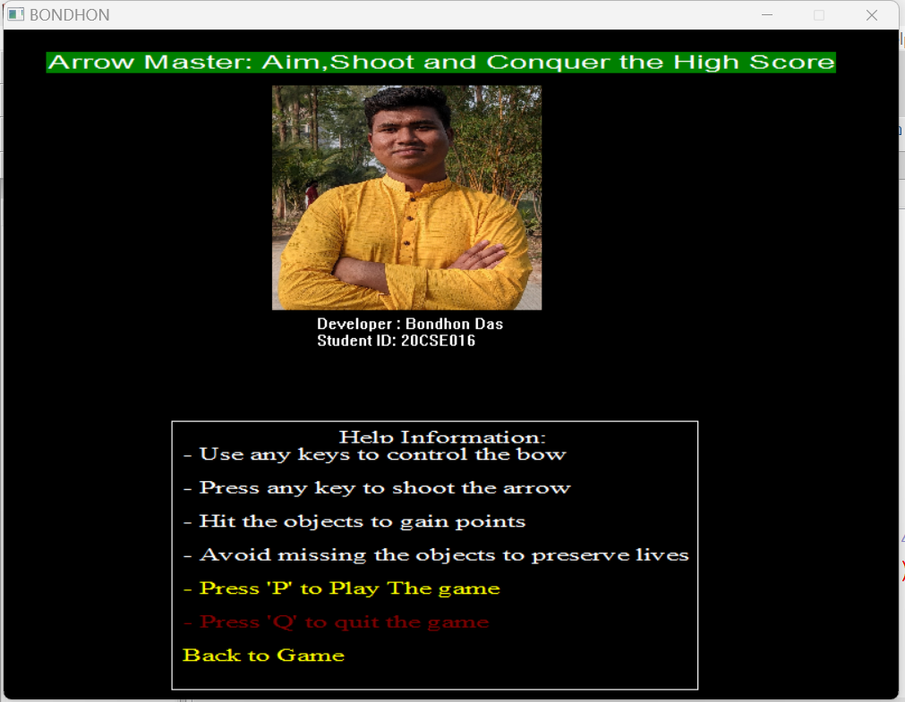
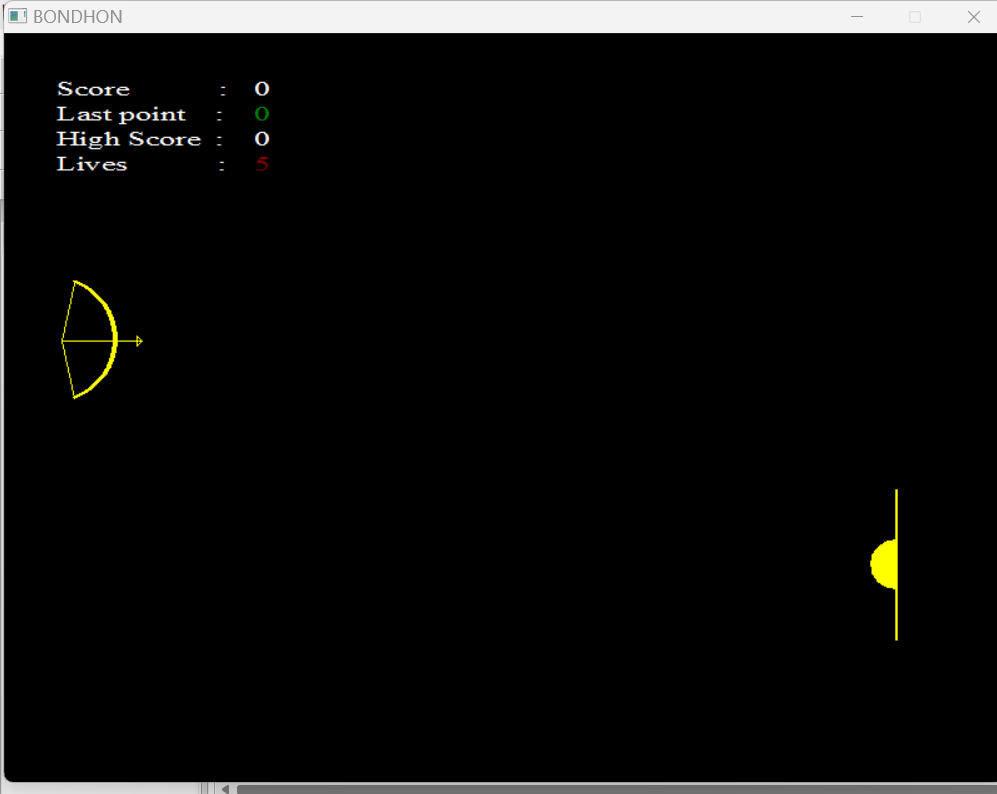
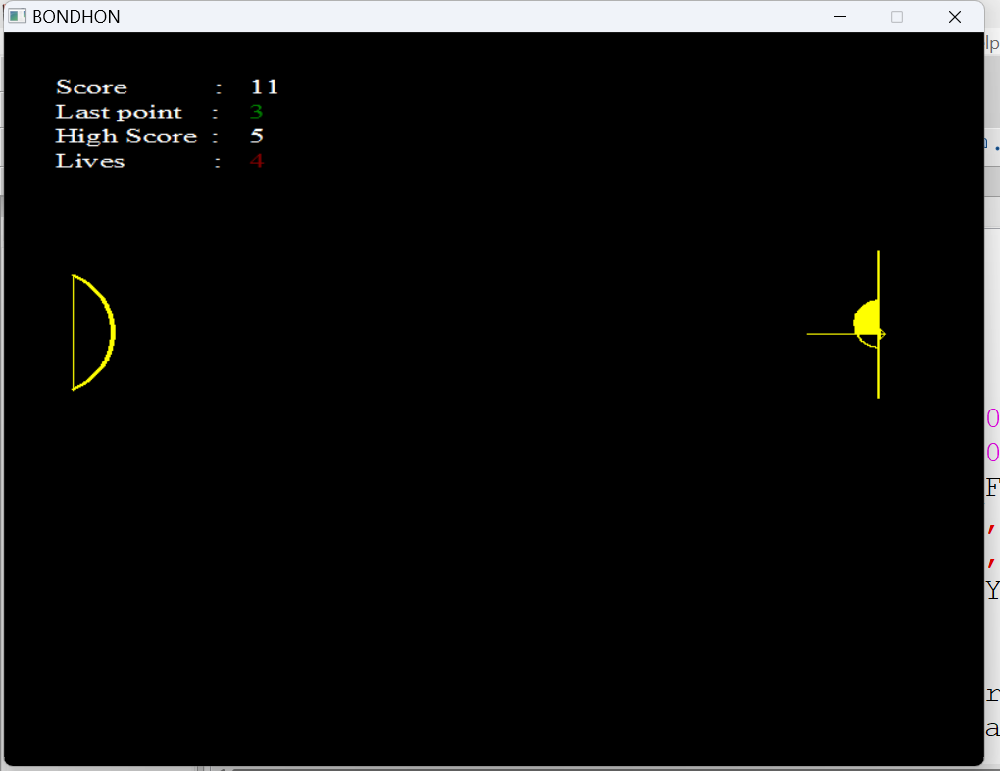

# Arrow Master

**Arrow Master** is a 2D archery game built with C++ using the `graphics.h` (WinBGIm) library. The objective of the game is to aim, shoot, and conquer the high score by hitting moving targets!

## 🎮 Features
*   **Classic 2D Graphics**: Built completely using primitive drawing functions from the BGI graphics library.
*   **Dynamic Gameplay**: The target moves up and down automatically.
*   **Scoring System**: Points are awarded based on where the arrow hits the target (bullseye grants more points).
*   **Lives System**: You start with 5 lives. Missing the target or letting the arrow fly off-screen costs a life.
*   **Persistent High Score**: Your highest score is saved locally in `score.txt` and updates automatically when broken.

## 🎥 Gameplay Video
Check out a short preview of the gameplay:
<video src="18.07.2023_00.39.49_REC.mp4" controls="controls" style="max-width: 100%;">
  Your browser does not support the video tag.
</video>

## 📸 Screenshots

## 🕹️ How to Play
1.  Launch the game.
2.  Press **'P'** to start the game. (Press **'Q'** to quit).
3.  The target will move vertically on the right side of the screen.
4.  Press **any key** on your keyboard to shoot the arrow.
5.  Try to time your shot to hit the center of the moving target for maximum points!

## ⚙️ Dependencies & Installation

Since this project utilizes the legacy `<graphics.h>` library, you need to configure your C++ compiler (usually MinGW on Windows) with the **WinBGIm** library.

### Prerequisites
*   Windows OS (Recommended for WinBGIm)
*   **Code::Blocks IDE** (with **32-bit MinGW** compiler included) or Dev-C++. 
    *   *Note: The standard `WinBGIm` library (`libbgi.a`) is typically compiled for 32-bit architectures. Therefore, you **must** use a 32-bit version of MinGW to compile this game. Using a 64-bit compiler will usually result in linker errors.*

### Setup Instructions (for Code::Blocks 32-bit)
1.  **Download WinBGIm Library**: Find and download the WinBGIm files (`graphics.h`, `winbgim.h`, and `libbgi.a`).
2.  **Include Files**: 
    *   Copy `graphics.h` and `winbgim.h` into the `include` folder of your Code::Blocks MinGW installation (e.g., `C:\Program Files\CodeBlocks\MinGW\include`).
3.  **Library File**: 
    *   Copy `libbgi.a` into the `lib` folder (e.g., `C:\Program Files\CodeBlocks\MinGW\lib`).
4.  **Linker Settings**:
    *   Open Code::Blocks. Go to **Settings -> Compiler**.
    *   Under the **Linker settings** tab, in the **Other linker options** box, paste the following exactly:
        `-lbgi -lgdi32 -lcomdlg32 -luuid -loleaut32 -lole32`
5.  **Compile and Run**:
    *   Open `arrow master.cpp` in Code::Blocks.
    *   Ensure all project assets (`7.jpg.jpg`, `score.txt`, etc.) are in the same directory as the `.cpp` file.
    *   Build and run the project!

## 👤 Developer
*   **Developer**: Bondhon Das
*   **Student ID**: 20CSE016
